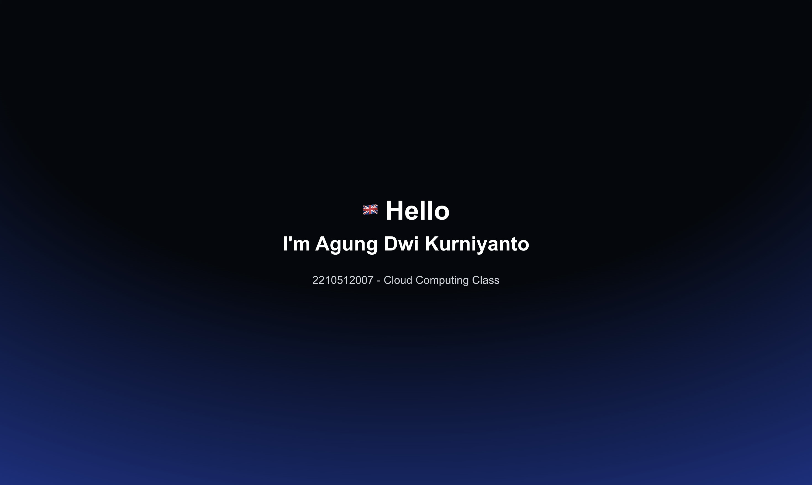

# My Next.js App

A modern Next.js application with multi-language typewriter effect and full CI/CD pipeline.



## ✨ Features

- 🎨 Multi-language typewriter effect (Indonesian, English, Japanese, French)
- 🎭 Smooth animations with Framer Motion
- 🐳 Docker & Kubernetes ready
- 🚀 Automated CI/CD with GitHub Actions

## 🚀 Quick Start

```bash
# Development
make dev                    # Start development server
make k8s-port-forward       # Access K8s deployment

# Production
make build-prod             # Build production image
make k8s-deploy            # Deploy to Kubernetes
```

Open [http://localhost:3000](http://localhost:3000)

## 📦 Main Commands

### Development

```bash
make dev              # Run development
make logs-dev         # View logs
make down-dev         # Stop container
```

### Kubernetes

```bash
make k8s-deploy       # Deploy to K8s
make k8s-status       # Check status
make k8s-logs         # View logs
make k8s-stop         # Stop pods
make k8s-start        # Start pods
```

### General

```bash
make help             # Show all commands
make clean            # Clean up
```

## 🛠️ Tech Stack

- **Framework:** Next.js 15 + TypeScript
- **Styling:** Tailwind CSS
- **Animation:** Framer Motion
- **Container:** Docker + Kubernetes
- **CI/CD:** GitHub Actions → GHCR

## 📁 Project Structure

```
mynextjs-app/
├── .github/workflows/      # CI/CD pipelines
├── app/                    # Next.js pages
├── components/ui/          # React components
├── Dockerfile              # Multi-stage build
├── k8s-deployment.yaml     # K8s manifests
└── Makefile               # Automation scripts
```

## 👨‍💻 Author

**Agung Dwi Kurniyanto**  
2210512007 - Cloud Computing Class
